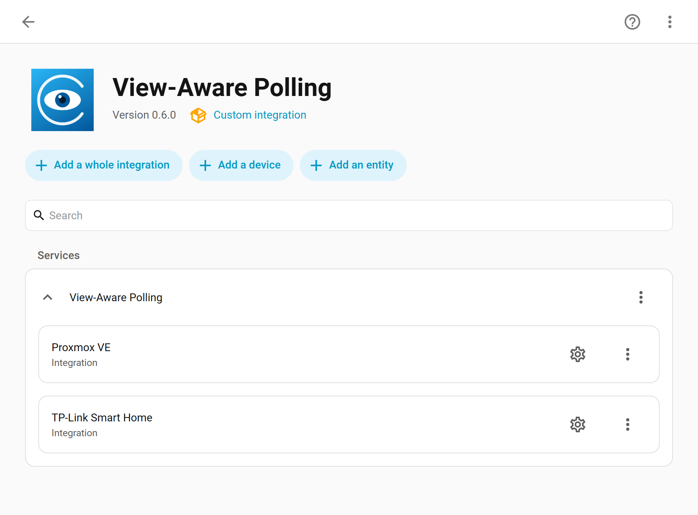
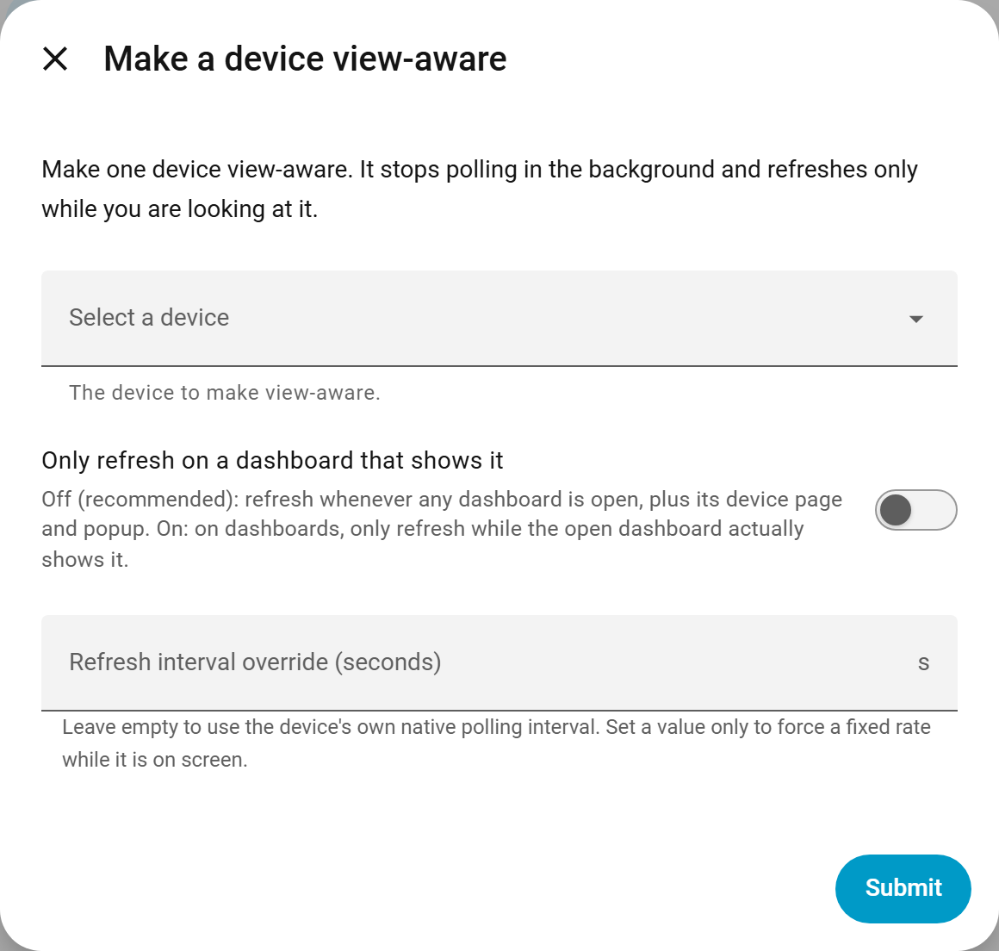

# HA View-Aware Polling

A Home Assistant custom integration that makes a **polling integration go idle in the background** and refresh **only while you are actually looking at it** in a browser: on a dashboard, in the more-info dialog, or on the device page.

## The problem

Polling integrations (Proxmox VE, smart plugs with power monitoring, many cloud integrations) query their device or API on a **fixed timer**, forever, whether or not anyone is looking. A Proxmox node's CPU, memory and disk sensors change every poll, so they fire a constant stream of `state_changed` events and (unless excluded) recorder writes, 24/7, even though you only ever look at that data when you open the dashboard.

Home Assistant has **no built-in way** to say "only poll this while I am viewing it". Integrations rarely expose a configurable interval, and there is no core "dashboard is open" or "entity is on screen" signal. See the [WTH about adjusting polling intervals](https://community.home-assistant.io/t/wth-is-there-no-good-way-to-adjust-an-integrations-polling-interval/813238) and [this dashboard-conditional polling thread](https://community.home-assistant.io/t/enable-integration-automatic-polling-only-when-visiting-a-certain-dashboard-page/606881).

## What it does

1. You pick what to make view-aware at one of **three levels**: a whole **integration**, a single **device**, or a single **entity**.
2. It sets **`pref_disable_polling`** on the owning config entries, so they stop polling in the background entirely.
3. A small global frontend module then calls `homeassistant.update_entity` on the relevant entities **only while they are on screen**, and only while the browser tab is visible. It stops the instant you navigate away, close the more-info dialog, or background the tab.

The result: the integration is silent when nobody is looking, and live when you are.

## Configuration at a glance

Everything is configured in the UI. Each target you add becomes its own row on the integration page, showing its name and (if you changed them) its scope and interval:

The three **Add** buttons let you pick an **integration**, a **device**, or an **entity**. Each one opens the same short form: choose the target, optionally restrict it to only refresh on a dashboard that shows it, and optionally override the refresh interval.

## Features

- **Three levels of granularity**, each added the same way:
  - a whole **integration** (every device and entity it owns becomes view-aware),
  - a single **device**, or
  - a single **entity**.
- **Three "on screen" surfaces**, automatically, everywhere, not just one dashboard card:
  - the entity's **more-info dialog** is open, or
  - you are on its **device page** (`/config/devices/device/<id>`), or
  - a **Lovelace dashboard** showing it is the active view.
- **Per-target scope** for the dashboard case, set with one toggle when you add or edit the target:
  - off (default): refresh whenever **any** dashboard is the active view. Simple, and great for a dedicated monitoring panel.
  - on ("only refresh on a dashboard that shows it"): refresh on a dashboard **only if that view actually contains the entity**.
- **Native interval, no tuning**: each target refreshes at its **own** normal poll interval while viewed (read from the integration's coordinator), so Proxmox stays at 60s and a fast plug at 5s without you configuring anything. A per-target override is available if you want one.
- **Tab-visibility aware**: a backgrounded tab does not poll.
- **Efficient**: refreshing one entity of a coordinator refreshes its whole set, so it pokes one representative entity per device.
- **No frontend YAML**: the module is injected automatically; there is nothing to add to `configuration.yaml`.

## How it works

| Surface | How it is detected |
|---|---|
| More-info dialog | the window-level `hass-more-info` event (entity id) and `dialog-closed` |
| Device page | `location.pathname` matches `/config/devices/device/<id>` |
| Dashboard | the active panel's `component_name` is `lovelace`; for the "only when shown" scope, the current view's config is read via `lovelace/config` to check whether it contains the entity |

The frontend module is served by the integration and registered globally via the frontend `extra_module_url` mechanism (the same mechanism card-mod and similar tools use).

## Installation

### HACS (recommended)

This is not (yet) in the default HACS store, so add it as a custom repository:

1. HACS, top-right menu, **Custom repositories**.
2. Repository `https://github.com/mayerwin/ha-view-aware-polling`, Category **Integration**, then **Add**.
3. Find **View-Aware Polling** in HACS and **Download** it.
4. **Restart Home Assistant.**

Installing through HACS means Home Assistant will **prompt you when a new version is released**.

### Manual

Copy `custom_components/view_aware_polling/` into your Home Assistant `config/custom_components/` directory, then restart.

## Configuration

It is configured entirely in the UI.

1. **Settings -> Devices & Services -> Add Integration -> View-Aware Polling.** This adds the integration; there is nothing to fill in.
2. Open it (**Settings -> Devices & Services -> View-Aware Polling**) and use the **Add** buttons to add targets:
   - **Add a whole integration**: make every device and entity of an integration view-aware (for example Proxmox VE or TP-Link).
   - **Add a device**: make one device view-aware.
   - **Add an entity**: make one entity view-aware.
3. Each target appears as a **row**. Use the **gear** to edit it or the **menu** to delete it.

### Per-target options

When you add or edit a target, two options are offered:

| Option | Default | What it does |
|---|---|---|
| **Only refresh on a dashboard that shows it** | off | Off: refresh whenever any dashboard is open (plus its device page and popup). On: on dashboards, only refresh while the open dashboard actually shows it. |
| **Refresh interval override (seconds)** | _native_ | Leave empty and the target refreshes at its **own** native poll interval while viewed (read from the integration's coordinator; disabling polling does not erase that interval). Set a value to force one fixed rate while it is on screen. |

A target is **always** refreshed while its more-info dialog is open or you are on its device page, regardless of the scope toggle. The toggle only controls the **dashboard** behaviour:

- **off (any dashboard)**: refresh whenever any dashboard is the active view. Simple and robust; ideal when you have a dedicated monitoring dashboard, or you just want "live while I am using HA, idle otherwise".
- **on (only when shown)**: refresh on a dashboard only if that view's configuration contains the entity. More precise, at the cost of relying on the view's **static** card config. Entities added by dynamic cards such as `auto-entities` are not detected this way, so leave the toggle off (or rely on more-info and the device page) for those.

When you add a whole **integration**, its scope and interval apply to all of its devices and entities. You can still add a specific device or entity from that same integration as its own row to give it different settings; the more specific row wins.

## Notes and caveats

- **It relies on Home Assistant frontend internals** (`extra_module_url`, the `hass-more-info` event, `lovelace/config`). These are stable and widely used (card-mod and browser_mod lean on the same surface), but a major frontend release could require a small update here.
- **The "any dashboard" scope and a wall tablet**: if you keep a dashboard open permanently on a tablet, those targets keep refreshing while that tab is foregrounded. Turn on "only refresh on a dashboard that shows it", or accept it as "live while displayed".
- **Disabling polling also freezes** the target's on/off and availability state between views; it only updates when viewed. For most monitoring data that is the whole point. If a target needs always-fresh state, do not make it view-aware.
- The module is cache-busted by version, so after an update a hard refresh of the browser picks up the new module.

## License

Copyright 2026 Erwin Mayer. Licensed under the [MIT License](LICENSE).
